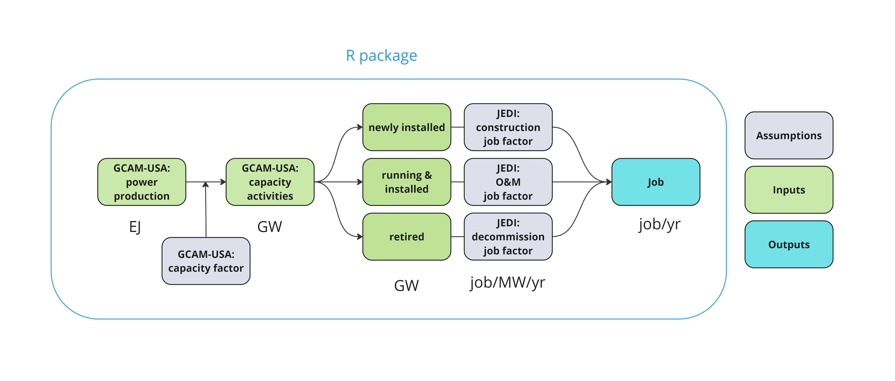

# GCAMUSAJobs: An R package for employment projections based on GCAM-USA power sector outcomes

<br />

<!-------------------------->
<!-------------------------->
# <a name="Contents"></a>Contents
<!-------------------------->
<!-------------------------->

- [Citation](#Citation)
- [Key Links](#KeyLinks)
- [Related Publications](#RelatedPublications)
- [Overview](#Overview)
- [Installation Guide](#InstallGuides)
- [How-to Guides](#How-toGuides)
- [User Notice](#UserNotice)
- [References](#References)

<br />

<!-------------------------->
<!-------------------------->
# <a name="Citation"></a>Citation
<!-------------------------->
<!-------------------------->

Di Sheng, Brian O'Neill, Stephanie Waldhoff, and Matthew Binsted. 2025. GCAMUSAJob: 
An R package for employment projections based on GCAM-USA power sector outcomes. 
(In progress) Journal of Open Source Software, DOI: XXXX

[Back to Contents](#Contents)

<br />

<br />

<!-------------------------->
<!-------------------------->
# <a name="KeyLinks"></a>Key Links
<!-------------------------->
<!-------------------------->

- Webpage hosting additional details: https://jgcri.github.io/GCAMUSAJobs/

[Back to Contents](#Contents)

<br />

<br />

<!-------------------------->
<!-------------------------->
# <a name="RelatedPublications"></a>Related Publications
<!-------------------------->
<!-------------------------->

Kennedy, K.M., S. Vo, K. Vangelov, B. Buddi, S. Smith, J. Lou, R. Cui, and N. Hultman (2024). 
“The Renewable Energy Transition in Maryland: Implications for Energy Generating Facilities and Small Businesses.” 
Center for Global Sustainability, University of Maryland. 50 pp.

[Back to Contents](#Contents)

<br />

<!-------------------------->
<!-------------------------->
# <a name="Overview"></a>Overview
<!-------------------------->
<!-------------------------->

`GCAMUSAJobs` (https://jgcri.github.io/GCAMUSAJobs/) aims to provide employment projections for the power sector based on GCAM-USA output. 
Specifically, this package was developed to post-process electric power projections from [GCAM-USA](https://jgcri.github.io/gcam-doc/gcam-usa.html), 
enabling the estimation of future power sector jobs at the state-level by generation technology and job type. Currently, GCAM-USA does not calculate 
power sector jobs. `GCAMUSAJobs` extends GCAM-USA functionality by 
(1) estimating the power plant capacity levels of different activities – operational capacity, capacity addition, and retirement; and 
(2) calculating jobs associated with those activities, including jobs in operation and maintenance (O&M), construction, and decommissioning. 



*Workflow of GCAMUSAJobs*

`GCAMUSAJobs` utilizes GCAM-USA annual electricity generation outputs to estimate underlying capacity levels based on assumptions about capacity factors 
and calculate associated power sector jobs based on employment factors. The employment factor represents the average number of jobs created per unit of 
power plant activity (e.g., jobs per gigawatt). This method is widely used in the relevant literature<sup>1,2</sup>. `GCAMUSAJobs` adopts employment factors from 
NREL’s Jobs & Economic Development Impacts [(JEDI)](https://www.nrel.gov/analysis/jedi/models.html) model, which has been broadly used in the literature<sup>1,3,4</sup>. 
The tool focuses on estimating direct jobs in the power sector, meaning employment directly involved in the construction, operation, or decommissioning 
of power plants, as opposed to indirect or induced jobs in the broader economy.

This functionality supports the need for assessing the distributional labor impacts of energy system transition. 

[Back to Contents](#Contents)

<br />

<!-------------------------->
<!-------------------------->
# <a name="Citation"></a>Citation
<!-------------------------->
<!-------------------------->


[Back to Contents](#Contents)

<br />


<!-------------------------->
<!-------------------------->
# <a name="InstallationGuides"></a>Installation Guides
<!-------------------------->
<!-------------------------->

1. Download and install:

    - R (https://www.r-project.org/)
    - R studio (https://www.rstudio.com/)

2. For Linux users, install following libraries:

```
sudo apt install build-essential libcurl4-gnutls-dev libxml2-dev libssl-dev
sudo apt-get install libxml2-dev
```
    
3. Open R studio:

```
install.packages('devtools')
devtools::install_github('JGCRI/rgcam')
devtools::install_github('JGCRI/GCAMUSAJobs')
```

[Back to Contents](#Contents)

<br />


<!-------------------------->
<!-------------------------->
# <a name="How-toGuides"></a>How-to Guides
<!-------------------------->
<!-------------------------->

- [Package vignette](https://jgcri.github.io/GCAMUSAJobs/articles/package_vignette.html)

[Back to Contents](#Contents)

<br />

<!-------------------------->
<!-------------------------->
# <a name="UserNotice"></a>User Notice
<!-------------------------->
<!-------------------------->

`GCAMUSAJobs`, by default, works with GCAM-USA v7.1 , and is compatible with outcomes with GCAM v6 or later versions conditional updated GCAM-USA assumption input. `GCAMUSAJobs` provides annual average job estimates during the 5-year window of a model timestep.


[Back to Contents](#Contents)

<br />
