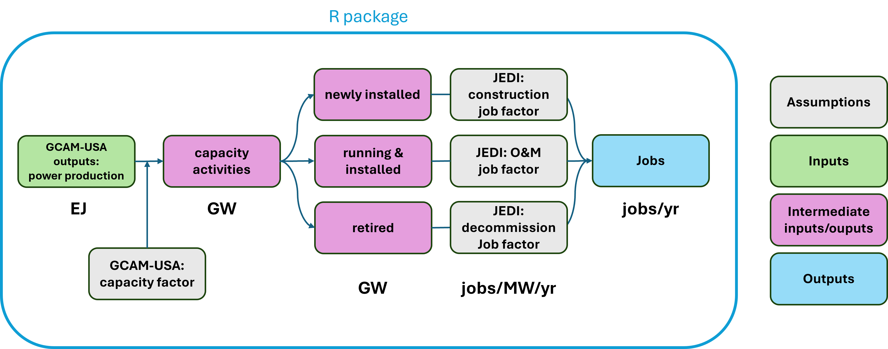
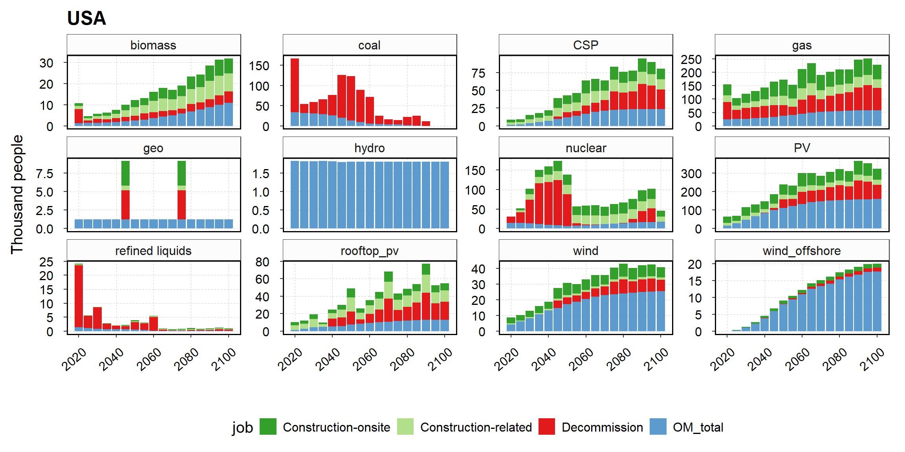

# Summary

The `GCAMUSAJobs` R package was developed to post-process electric power
projections from GCAM-USA [@GCAM82], enabling the estimation of future power sector jobs
at the state-level by generation technology and job type. `GCAMUSAJobs` extends
GCAM-USA functionality by (1) estimating the capacity levels of different
activities – operational capacity, capacity addition, and retirement; and (2)
calculating jobs associated with production activities, including those in
operation and maintenance (O&M), construction, and decommissioning.
Additionally, this package is designed to be easily adaptable to the output of
other energy system models besides GCAM-USA.

# Statement of need

The development of `GCAMUSAJobs` was driven by the need to assess the
distributional labor impacts of energy system evolution [@xie2023distributional;
@mayfield2023labor; @hanson2023local; @raimi2021mapping]. While gross employment
[@mayfield2023labor] and power sector employment [@xie2023distributional] are
expected to grow into the future, under both business as usual (BAU) and
alternative scenarios, @xie2023distributional find insignificant differences in
the U.S. national power sector jobs between BAU and decarbonization scenarios.
However, distributional differences across U.S. states are much more
significant, e.g., fossil fuel-intensive states may experience slower job growth
or job losses, which was also found in other studies [@hanson2023local;
@mayfield2023labor].

The Global Change Analysis Model (GCAM) and its ancillary model GCAM-USA
[@GCAM82] are powerful tools for studying energy systems dynamics and evolution.
Many previous studies have applied or integrated the tool to analyze potential
impacts on the energy system and associated outcomes due to environmental and
socioeconomic changes [e.g., @feijoo2020us; @ganji2024implications;
@ou2018estimating; @pan2025assessment; @zhang2025long]. Currently, GCAM-USA does
not calculate power sector jobs. `GCAMUSAJobs` addresses this gap by providing
projected direct power sector jobs based on GCAM-USA output, enhancing the
functionality of GCAM-USA for labor impact analysis.

# Software design

The direct purpose of `GCAMUSAJobs` is to calculate different types of jobs in
the power sector across U.S. states, built upon the existing open-source model
GCAM-USA. As GCAM-USA is a complex multi-sector model with technological
details, our design involves in-depth understanding and testing of how various
components work together in GCAM-USA, especially in the power sector, so that we
can properly design the jobs calculation in our package and source available
matching data (e.g., employment factors). This requires irreplaceable human
efforts to comprehend the existing software and extend its capability through
collaboration with GCAM-USA modelers and domain experts in socioeconomics.

`GCAMUSAJobs` is also designed to be easily adaptable to the output of broader
energy system models to enable extended employment analysis. `GCAMUSAJobs`
provides detailed employment factors extracted from simulations of the Jobs &
Economic Development Impacts (JEDI) model [@nrel_jobs_nodate], which calculates
employment factors under a range of assumptions about power sector technologies.
This means users can supply capacity activity output from an energy system model
in the required format and conduct employment analysis using those readily
applicable employment factors. For GCAM-USA users, the workflow is further
simplified by directly ingesting GCAM-USA output databases in their original
format and automatically performing capacity activity and employment analysis.

The package structure also allows users to access intermediate outputs and
develop custom functions to examine or adapt analytical components. Besides,
`GCAMUSAJobs` includes user-configurable options for key model assumptions and
built-in visualization tools for rapid diagnostics.

# Research impact statement

`GCAMUSAJobs` enables a new workflow to analyze various potential impacts on
power sector jobs across U.S. states. Sources of impact can include, but are not
limited to, socioeconomic development, environmental change, policy targets, and
technological advancement. `GCAMUSAJobs` can perform ex-ante quantitative
analysis of the associated distributional impacts on state-level power sector
jobs. It can support analytical work in academic research and inform
policymaking by providing useful information for preparedness and targeted
responses to the anticipated impacts. To our knowledge, no such tool exists that
extends the capability of an integrated multi-sector model (e.g., GCAM-USA) to
analyze the impact on employment. `GCAMUSAJobs` has been used by researchers at
the University of Maryland (external adopter) for a published report on the
renewable energy transition in Maryland and its implications
[@Kennedy2024renewable]. Specifically, the report provides direct job estimates
at Maryland’s thermal power plants based on facility characteristics (e.g.,
nameplate capacity, capacity factor, and fuel type) and the employment factors
produced by this package. Meanwhile, the package is expected to be developed by
external researchers to expand its capabilities and grow its user base.

# Workflow

`GCAMUSAJobs` utilizes GCAM-USA annual electricity generation outputs to
estimate underlying capacity levels based on assumptions about capacity factors
and calculate associated power sector jobs based on employment factors (Fig. 1).
The employment factor represents the average number of jobs created per unit of
power production activity (e.g., jobs per gigawatt). This method is widely used
in the relevant literature [@rutovitz2015calculating; @mayfield2023labor].
`GCAMUSAJobs` adopts employment factors from the JEDI model, which has been
broadly used in the literature [@xie2023distributional;
@rutovitz2015calculating; @jacobson2017100].

# Key functions

`GCAMUSAJobs::GCAM_EJ` queries power generation data (in exajoules, EJ) from the
GCAM-USA output database for a single scenario, disaggregating generation from
existing plants, newly added plants, and the generation lost from recently
retired plants. The output is provided annually, broken down by state and fuel
technology. Building on this, `GCAMUSAJobs::GCAM_GW`, taking the output from
`GCAMUSAJobs::GCAM_EJ`, calculates the average annual capacity levels (in
gigawatts, GW) by state and fuel technology for different activities, including
operation, addition, and retirement. It supports both the “Total” and “Net”
methods. In the “Total” method, all capacity additions and retirements are
counted separately. In the “Net” method, premature retirement is offset with
capacity addition. The “Total” method is better suited for large states with
many facilities, where it is plausible that while one plant is retiring, a
facility at a different location in the state is beginning construction. In
small states with few facilities, simultaneous retirement and addition may not
reflect reality. For example, if only one coal plant exists in a small state and
it retires, any new capacity is likely a direct replacement, not a separate
project. In this case, the replacement would imply a lower number of jobs needed
than if the retirement and addition occurred as separate projects. The two
options of user-defined methods ensure that job estimates for capacity expansion
and decommissioning remain realistic and regionally appropriate.
`GCAMUSAJobs::GCAM_JOB` then utilizes the output from `GCAMUSAJobs::GCAM_GW` to
estimate the average annual job estimates, broken down by fuel type and job
type, including construction (both on-site and construction-related), operations
& maintenance, and decommissioning. Users can select between the “Total” or
“Net” method, with “Total” used as the default. `GCAMUSAJobs` also provides a
list of functions to visualize the employment factor assumptions, capacity, and
job outcomes.

`GCAMUSAJobs::GCAM_EJ` is compatible with both the GCAM-USA output database as
well as a project data file queried using the R package `rgcam`. Please refer to
the package vignette for additional examples and visualizations.

## Implementation

For demonstration purposes, we use `GCAMUSAJobs` to post-process the outcome
from GCAM v7.1 for a standard reference scenario, estimating the direct job,
aggregated over states, associated with U.S. power generation (Fig. 2).

# AI usage disclosure

No generative AI tools were used in the development of this software, the
writing of this manuscript, or the preparation of supporting materials.

# Acknowledgment

This research was supported by the Laboratory Directed Research and Development
(LDRD) Program at Pacific Northwest National Laboratory (PNNL). PNNL is a
multi-program national laboratory operated for the U.S. Department of Energy
(DOE) by Battelle Memorial Institute under Contract No. DE-AC05-76RL01830. We
also appreciate the support from Kanishka Narayan, Ben Bond-Lamberty, Mengqi
Zhao, and Gokul Iyer. The views and opinions expressed in this paper are those
of the authors alone.

# References
