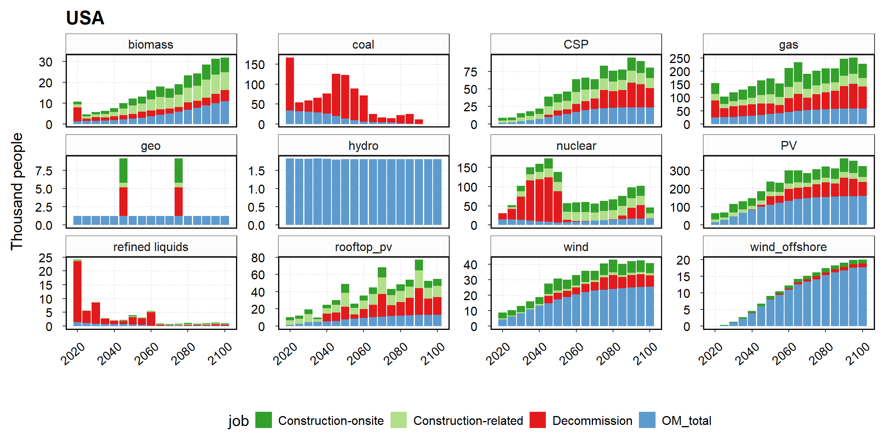

# Summary

The `GCAMUSAJobs` R package was developed to post-process electric power
projections from GCAM-USA, enabling the estimation of future power sector jobs
at the state-level by generation technology and job type. `GCAMUSAJobs` extends
GCAM-USA functionality by (1) estimating the capacity levels of different
activities – operational capacity, capacity addition, and retirement; and (2)
calculating jobs associated with production activities, including those in
operation and maintenance (O&M), construction, and decommissioning.

# Statement of need

The development of `GCAMUSAJobs` was driven by the need to assess the
distributional labor impacts of energy system transition
[@xie2023distributional; @mayfield2023labor; @hanson2023local;
@raimi2021mapping]. While gross employment [@mayfield2023labor] and power sector
employment [@xie2023distributional] are expected to grow into the future,  over
time under both business as usual and decarbonization, @xie2023distributional
find insignificant differences in power sector jobs between the two scenarios.
Other research has also suggested that fossil fuel-intensive states may
experience slower job growth or job losses [@hanson2023local;
@mayfield2023labor].

Currently, GCAM-USA does not calculate power sector jobs. `GCAMUSAJobs`
addresses this gap by providing projected direct power sector jobs based on
GCAM-USA output, enhancing the functionality of GCAM-USA for labor impact
analysis.

# Workflow

`GCAMUSAJobs` utilizes GCAM-USA annual electricity generation outputs to
estimate underlying capacity levels based on assumptions about capacity factors
and calculate associated power sector jobs based on employment factors (Fig. 1).
The employment factor represents the average number of jobs created per unit of
power production activity (e.g., jobs per gigawatt). This method is widely used
in the relevant literature [@rutovitz2015calculating; @mayfield2023labor].
`GCAMUSAJobs` adopts employment factors from NREL’s Jobs & Economic Development
Impacts (JEDI) model (<https://www.nrel.gov/analysis/jedi/models.html>), which
has been broadly used in the literature [@xie2023distributional;
@rutovitz2015calculating; @jacobson2017100].

# Key functions

`GCAMUSAJobs::GCAM_EJ` queries power generation data (in exajoules, EJ) from the
GCAM-USA output database for a single scenario, disaggregating generation from
existing plants, newly added plants, and the generation lost from recently
retired plants. The output is provided annually, broken down by state and fuel
technology. Building on this, `GCAMUSAJobs::GCAM_GW`, taking the output from
`GCAMUSAJobs::GCAM_EJ`, calculates the average annual capacity levels (in
gigawatts, GW) by state and fuel technology for different activities, including
operation, addition, and retirement. It supports both the “Total” and “Net”
methods. In the “Total” method, all capacity additions and retirements are
counted separately. In the “Net” method, premature retirement is offset with
capacity addition. The “Total” method is better suited for large states with
many facilities, where it is plausible that while one plant is retiring, a
facility at a different location in the state is beginning construction. In
small states with few facilities, simultaneous retirement and addition may not
reflect reality. For example, if only one coal plant exists in a small state and
it retires, any new capacity is likely a direct replacement, not a separate
project. In this case, the replacement would imply a lower number of jobs needed
than if the retirement and addition occurred as separate projects. The two
options of user-defined methods ensure that job estimates for capacity expansion
and decommissioning remain realistic and regionally appropriate.
`GCAMUSAJobs::GCAM_JOB` then utilizes the output from `GCAMUSAJobs::GCAM_GW` to
estimate the average annual job estimates, broken down by fuel type and job
type, including construction (both on-site and construction-related), operations
& maintenance, and decommissioning. Users can select between the “Total” or
“Net” method, with “Total” used as the default. `GCAMUSAJobs` also provides a
list of functions to visualize the employment factor assumptions, capacity, and
job outcomes.

`GCAMUSAJobs::GCAM_EJ` is compatible with both the GCAM-USA output database as
well as a project data file queried using the R package `rgcam`. Please refer to
the package vignette for additional examples and visualizations.

## Implementation

For demonstration purposes, we use `GCAMUSAJobs` to post-process the outcome
from GCAM v7.1 for a standard reference scenario, estimating the direct job,
aggregated over states, associated with U.S. power generation (Fig. 2).

# Acknowledgment

This research was supported by the Laboratory Directed Research and Development
(LDRD) Program at Pacific Northwest National Laboratory (PNNL). PNNL is a
multi-program national laboratory operated for the U.S. Department of Energy
(DOE) by Battelle Memorial Institute under Contract No. DE-AC05-76RL01830. We
also appreciate the support from Kanishka Narayan, Ben Bond-Lamberty, Mengqi
Zhao, and Gokul Iyer. The views and opinions expressed in this paper are those
of the authors alone.

# Mention

This package is used by researchers at the University of Maryland for a
published report on the renewable energy transition in Maryland and its
implications [@Kennedy2024renewable]. Specifically, the report provides direct job estimates at
Maryland’s thermal power plants based on facility characteristics (e.g.,
nameplate capacity, capacity factor, and fuel type) and the employment factors
produced by this package.

# References
