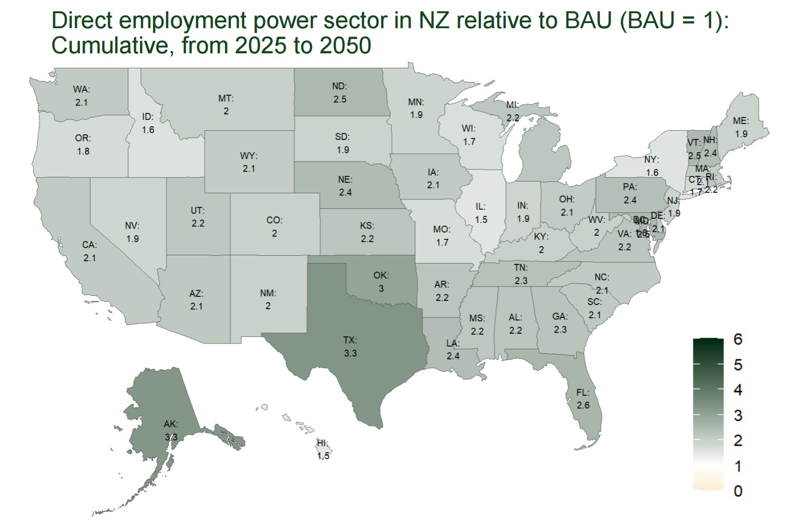
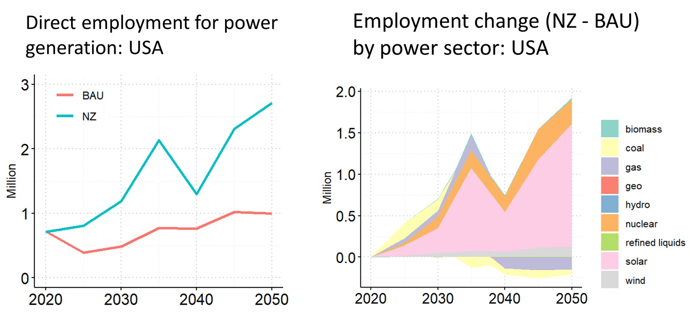
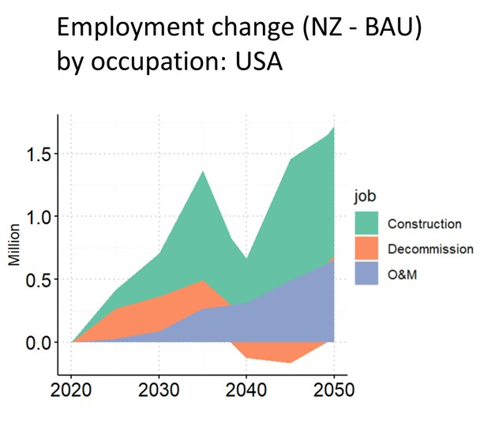

We conducted a case study, utilizing this R package, to *evaluate the employment implications of transitioning the U.S. power sector to net-zero greenhouse gas emissions by mid-century*. Transitioning to a low-carbon power system introduces heterogeneous impacts on employment across regions and sectors^1–4^. Integrating energy and employment modeling is crucial to assess and address the impacts of decarbonization on employment. This analysis uses [outputs from GCAM-USA](https://doi.org/10.5281/zenodo.10642507) and applies the package to estimate direct power sector employment under two scenarios: Business-as-Usual (BAU) and Net Zero (NZ). We find that achieving Net Zero in the U.S. by mid-century promotes direct employment for power generation, especially in Texas, Alaska, Oklahoma, and Florida. 

  

Cumulatively, direct employment of the power sector under the NZ scenario is projected to be 2.36 times that in the BAU from 2025 to 2050. Under the net-zero scenario, employment growth mainly comes from solar, nuclear, and wind power generation.

  

Decarbonization in the power sector drives steady growth for O&M jobs, while the cyclical nature of construction and decommission jobs creates volatility in job growth.

  

*Side note*: This package is also used by researchers at the University of Maryland for a published report on the renewable energy transition in Maryland and its implications^5^. Specifically, the report provides direct job estimates at Maryland's thermal power plants based on facility characteristics (e.g., nameplate capacity, capacity factor, and fuel type) and the employment factors produced by this package. For more details, please refer to ^5^.

 
_________

1.	Mayfield, E., Jenkins, J., Larson, E. & Greig, C. Labor pathways to achieve net-zero emissions in the United States by mid-century. *Energy Policy* 177, 113516 (2023).
2.	Xie, J. J., Martin, M., Rogelj, J. & Staffell, I. Distributional labour challenges and opportunities for decarbonizing the US power system. *Nat. Clim. Change* 13, 1203–1212 (2023).
3.	Hanson, G. H. Local Labor Market Impacts of the Energy Transition: Prospects and Policies. (2023).
4.	Raimi, D. Mapping county-level exposure and vulnerability to the US energy transition. *Resour. Future* 21–36 (2021).
5.	Kennedy, K. M. et al. The Renewable Energy Transition in Maryland: Implications for Energy Generating Facilities and Small Businesses. 50 pp. (2024).

 
 
 
